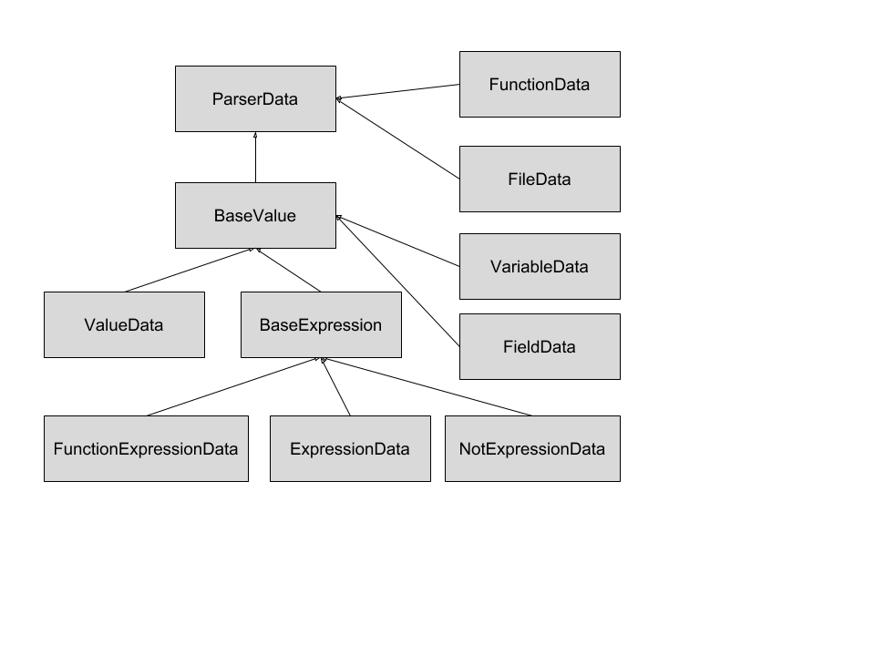

# Compiler *Nimble*


Gemaakt door: Joris Willems<br>
Student nummer: 349672<br>
Datum: 27-8-2018<br>

---

# Inhoudsopgave
1. [Taal introductie](#introductie)
	1. [Data typen](#typen)
	2. [Commentaar](#commentaar)
	3. [Bestandsindeling](#indeling)
2. [Grammatica regels](#grammar)
	1. [Statements](#statements)
	2. [Expressies](#expressies)
	3. [Atromen](#atomen)
	4. [Overzicht visitor boom](#boom)
3. [Code architectuur](#architectuur)
	1. [Klasse structuur](#klasse-structuur)
4. [Databeheer](#databeheer)
	1. [Variabelen](#variabelen)

# 1. Taal introductie <a name="introductie"></a>
Nimble, wat vlug en licht in beweging betekend, is een programmeertaal die gebasseerd is op JavaScript, om vlugger
en eenvoudiger code te kunnen schrijven. Alles wordt net als in JavaScript in 1 bestand gedaan. Er zit wat syntactic
sugar in om minder code te hoeven schrijven. Bijvoorbeeld de print() methode roept automatisch system.out.println() op
onderwater. Verder zit er ook een autocast functie ingebakken die automatisch integers naar doubles cast.

```
int a = 3;
double b = a;
```

a Wordt automatisch gecast naar doubles.

```
double b = 3;
int a = b;
```

Zal een exceptie opleveren, dit is gedaan om ervoor te zorgen dat een programmeur niet zonder het door te hebben
komma getallen kan kwijtraken. Methodes onderwater zullen allemaal static zijn, maar deze hoeven niet zo gedeclareerd te
worden. Er zijn een aantal rules opgesteld die nog niet gebruikt worden, maar in de toekomst makkelijk uitgebreid kan
worden, zo worden er bijvoorbeeld de volgende functie wijzigers gebruikt, die onderwater hetzelfde doen:

* global (ofwel public in Java).
* package (ofwel protected in Java).
* internal (ofwel private in Java).

Deze termen spreken direct tot de verbeelding voor de ontwikkelaar. DataTypes hoeven niet geinitialiseerd te worden,
maar krijgen een automatische waarde toegewezen. 

```
main {
  int a;
  print(a)
}
```

zal als output: 0 opleveren. Alles mag direct worden geprint:

```
int a = 6;
string test = "test string";
print a + 3;  // 9
print 3 + a; // 9
print "een " + test; // een test string
print (test + 6); // test string6
```

Deze waarden zullen allemaal uitgeprint worden. 

## 1.1 Data typen
Nimble maakt gebruik van de volgende vier data typen:
* string (in java String)
* bool (in java boolean)
* int
* double

Wanneer er een double wordt verwacht, maar een integer is meegegeven wordt deze automatisch gecast.

## 1.2 Commentaar
In code commentaar kan via twee manieren worden toegevoegd:
1. \# Dit commentaar geld per regel.
2. <# Dit commentaar kan op meerdere regels verspreid worden #>

Commentaar mag zich overal bevinden, behalve binnen expressies.

## 1.3 Bestands indeling
Development bestanden in Nimble maken gebruik van de volgende extensie: `.nim`.
Wanneer de compiler gerund wordt, zal alles direct gebuild en gecompiled worden. De build bestanden zijn te vinden in
de nim-build folder. Bij elke build zal deze folder verwijderd en opnieuw gecreerd worden. Nimble zal een '*.j' bestand
maken in de build folder. Dit bestand is een Jasmin bestand, die vervolgens met de Jasmin library gecompileerd kan
worden m.b.v. het volgende commando:

```sh
java -jar ../lib/jasmin.jar App.j
```

Nimble zal automatisch het development bestand omzetten naar een Jasmin bestand. Dit Jasmin bestand zal vervolgens
gecompileerd worden naar een Java bestand en worden uitgevoerd. Boven aan het development bestand wordt de klasse gedeclareerd.

```
class App;
```

Deze klasse declaratie zal ook gebruikt worden om de bestandsnaam van de build toe te wijzen: `App.j of App.java`. 
Code begint bij het main blok zal in Java als `public static void main(String[] args) gedeclareerd worden.

```
class App;

main {
  # Do something...
}
```

Velden kunnen overal (buiten de main) gedeclareerd worden op de volgende manier:

```
global string test = "test";
```

Functies kunnen op de volgende manier gedeclareerd worden: 

```
global void someMethod(int a, string b) {
	
}
```

De compiler zal bij het runnen de output weergeven.

# 2. Grammatica regels
De grammatica regels worden in het bestand NimbleParser gedefinieerd. Programmeertalen maken gebruik van een aantal
vaste regels. Deze regels maken het opbouwen van de programmeertaal een stuk eenvoudiger.

## 2.1 Statements
Statements zijn syntaxtische delen van code dat een bepaalde actie definieerd. De volgende statements kunnen in nimble
gebruikt worden:
* variabel declaratie
* variabel implementatie
* if - else blokken
* while loops
* print
* returns
* functie aanroepen
* commentaar

Vaak bevatten statements weer expressies.

## 2.2 Expressies
Expressies zijn een combinatie van constanten, variabelen en operatoren. Zoals in 2.1 al is genoemd kunnen statements
expressies bevatten. Zoals bijvoorbeeld:

```
if(2 < 3) {
  # do something...
}
```

Hierboven bevat het if - else statement, de expressie: `2 < 3`. Expressies die gebruikt worden in Nimble zijn:
* Niet expressies (! ...)
* optel - aftrek expressies (a + b)
* vermenigvuldig - delen - rest expressies (a * b) (a / b) (a % b)
* relationele vergelijkingen (a < b)
* gelijkwaardige vergelijkingen (a == b)
* and, of operatoren (a || b) 
* en atomen (someBool)

## 2.3 Atomen
Atomen zijn inidivuele onderdelen van expressies. Atomen zijn bijvoorbeeld integers, strings, etc. Maar kunnen ook weer
interne expressies zijn:

```
if((2 < 3) && (3 < 4)) {
  # do something...
}
```

atom 1 is de expressie (2 < 3) ofwel true.

## 2.4 Overzicht visitor boom


Hierboven is een vereenvoudigde weergave van de NimbleVisitorTree. De boom begint en eindigt bij ParseTree. Recursief wordt alle data vanaf de bladeren naar boven geretouneerd. Op deze weergave zijn de expressies niet zichtbaar, deze expressies zullen de bladeren zijn van deze boom.

# 3. Code architectuur
De visitor klasse van ANTLR retouneerd de klasse: `ParserData`. In het begin heb ik getwijfeld om i.p.v. ParserData een
lijst met Strings (jasmin commando's) te retourneren maar heb hier uiteindelijk niet voor gekozen. M.b.v. een custom
klasse is er veel code herbruikbaar. Jasmin werkt ook niet altijd hezelfde, 'of' expressies werken bijvoorbeeld met
tegenovergestelde commando's. Een voorbeeld van een 'of' expressie:

```
if(someBool || someBool) {
	bool a = true;
} else {
	bool b = false;
}
```

Deze if constructie zal de volgende Jasmin code opleveren:

```
iload 6
ifeq label4
iload 6
ifne label5
label4:
iconst_1
istore 7
goto label3
label5:
iconst_0
istore 8
label3:
```

Hierboven is te zien dat de eerste someBool de commando's `iload 6, ifeq label4` krijgt. Vervolgens wordt deze via de
label direct naar de if block geleid: `bool a = true;`. De tweede somebool `iload 6, ifne label5` werkt zoals bij een
gewone if statement. Via ParserData kan een kopie van de commando `ifne` opgevraagd worden en vervolgens worden omgezet naar `ifeq`. Elk commando
kan automatisch worden 'omgedraaid'.

## 3.1 Klasse structuur
### 3.1.1 Packages
**generated** <br>
Binnen deze package zitten alle door ANTLR automatisch gegenereerde bestanden.

**main** <br>
De main package bevat de main klasse, de visitor klasse en de klasse om het project te builden.

**model** <br>
De model package bevat alle klasses die gebruikt worden om data op te slaan en te retourneren.

**model.commands** <br>
De commands sub package bevat de commando klasses. Deze klasses zijn makkelijker manipuleerbaar dan gewone Strings.

**utils** <br>
De utils package bevat allerlei helper klasses om data te vergaren en te manipuleren.

### 3.1.2 Klasses
De model klassen worden d.m.v overerving gezet. In het volgende diagram wordt de inheritance structuur duidelijk:



**ParserData** <br>
Deze klasse heeft constructor die een context verwacht. Deze context wordt gebruikt om foutmeldingen te genereren en om
data op te zoeken. Via een context kan je bijvoorbeeld achterhalen in welke functie deze Klasse is gegenereerd. Deze
klasse vervult vooral algemene zaken. De meer specifieke zaken worden allemaal door base klasses afgehandeld. Deze klasse heeft een aantal methodes:

* throw Error(String errorMsg);
Deze methode gooit een foutmelding, waarbij direct te zien is op welke regel de compiler is gecrashed.

* ArrayList<JavaByteCommands> getCode();
Deze methode retouneerd de toegevoegde commando's.

**BaseValue** <br>
Deze klasse is abstract en wordt voornamelijk gebruikt voor type checking, ook zitten hier methodes om waarden op de stack
te zetten, zoals Strings of integers.

**BaseExpression** <br>
Expressies erft over van BaseValue. Expressies hebben wat extra eigenschappen zoals 'labels' en de mogelijkheid om
boolean expressies retourneerbare waarde te geven. Van nature hoeft dat namelijk niet:

```
if(a < b) { # geen retourneerbare waarde.
  
}

bool someBool = (a < b); # wel retourneerbare waarde.
```

**ExpressionData** <br>
Deze klasse bevat bijna alle expressie methodes. De constructor verwacht een linker en rechter waarde (dit kan dus ook
weer een expressie zijn).

**FieldData / VariableData** <br>
Deze klasses opereren ongeveer gelijk. Belangrijk is dat deze klasses kopie constructoren bevat. Deze kopie
constructoren worden gebruikt om ongewenste manipulaties te voorkomen. Een voorbeeld kan zijn:

**FileData** <br>
Deze klasse is een uitzondering die op het eind wordt geretouneerd (begin van de visitor boom). Deze klasse zet alles
klaar voor het Jasmin bestand. Aan deze klasse worden alle functies en velden (fields) toegevoegd. Fia functie
containers kan info zoals het aantal locals dat nodig is voor de methode worden gezet. 

```
if(someBool || someBool)
```

Wanneer de linker someBool `ifne` omgedraaid wordt naar `ifeq`, mag dat alleen op het linker object gebeuren. Als deze
naar dezelfde referentie verwijzen zouden er problemen kunnen ontstaan. Dit probleem wordt vanaf het begin opgelost:

```Java
@Override
public ParserData visitIdentifierAtom(NimbleParser.IdentifierAtomContext ctx) {
	BaseValue var = JasminHelper.getFieldOrVariable(ctx.getText(), ctx);
	if (var == null)
		throw new ParseException(ctx, "Variable has not been declared yet.");
	else if (var instanceof FieldData)
		return new FieldData((FieldData) var);
	else
		return new VariableData((VariableData) var);
}
```

**JasminConstants** <br>
Dit is een constante klasse die alle Jasmin commando's bevat. Veel commando's zijn afgekort en niet makkelijk leesbaar,
deze klasse is om te ontwikkelaar daarbij te ondersteunen. Zo wordt `ifne` bijvoorbeeld `IF_NOT_EQUAL`.

# 4. Databeheer
Er is veel data wat niet zomaar geretouneerd kan worden en die opverschillende wijze berekend moet worden. Bijvoorbeeld
moeten methodes kennis hebben van de laatste index waar een variabelen is opgeslagen. Deze "persistente" data wordt
beheerd door de `JasminHelper` klasse. Deze JasminHelper klasse heeft voornamelijk static methodes die waarden retouneren aan
de hand van de context van de opvrager. Deze informatie worden met recursieve methodes opgehaald:

```Java
private static ParserRuleContext getRootContext(ParserRuleContext ctx) {
	if(ctx instanceof NimbleParser.FunctionContext || ctx instanceof NimbleParser.MainContext)
		return ctx;
	else if(ctx.invokingState == -1)
		return null;
	else
		return getRootContext(ctx.getParent());
}
```

Met deze root context kan bijvoorbeeld de functie identifier worden bepaald. 

## 4.1 Variabelen
Variabelen worden opgeslagen in een hashmap. De key is een hashCode die afkomstig is van een blok context. Elk blok kan
variabelen declareren. De reden dat deze per blok context worden opgeslagen en niet per functie is om de volgende
reden:

```
Main { # blockContext hash code 11100...
  string a = "some string";

  if(2 < 3) { # blockContext hash code 2141.....
    string b = "other string";
  } else { # blockContext hash code 1234.....
    string b = "normal string";
	a = "change string";
  }
}
```

String b mag in principe gezet worden, maar als deze op functie niveau worden opgeslagen zullen de twee strings clashen.
Per blok kan nu recursieve omhoog gewerkt worden om te kijken of deze variabelen geldig is. Dat wordt gedaan met de
volgende functie:

```Java
private static HashSet<Integer> getHashCodesRecursivelyUp(ParserRuleContext ctx, HashSet<Integer> hashCodes) {
	if(ctx.invokingState == -1) {
		return hashCodes;
	} else if(ctx instanceof  NimbleParser.BlockContext || ctx instanceof NimbleParser.FunctionContext) {
		hashCodes.add(ctx.hashCode());
	}

	return getHashCodesRecursivelyUp(ctx.getParent(), hashCodes);
}
```

Deze HashSet zal de hashcodes van de blokken ophalen, maar alleen vanaf caller omhoog. Naast deze help methode is er ook
een methode die het blok van de caller kan ophalen. Wanneer je een variabelen zet, zal deze opgeslagen worden in de
eerste block die de vrager richting root tegenkomt. 

Hash codes kunnen in principe botsen, maar de kans is miniem. In de toekomst zou daar nog iets op gevonden kunnen worden
om deze bosting te ontwijken.

## 4.1.1 Containers
FunctionContainers slaan data op m.b.t. de functie. Deze containers kunnen benaderd worden via de JasminHelper m.b.v. de
functie identifier. Deze klasse bevatten informatie over de variabelen index van deze functie, de return waarde en de
constructor parameters. Deze constructer parameters moeten "persistent" beheerd worden, omdat de aanvraag van de
methode niks weet van de methode zelf. De aanvraag methode moet in het volgende geval een foutmelding opleveren:

```
main {
	function("this is a string");
}

global void function(int a) {
	# do something ...
}
```

In de visitor kan de identifier van de aanroeper van de methode bepaalde worden. Deze identifier kan gebruikt worden
om de functionContainer op te halen via de JasminHelper.


